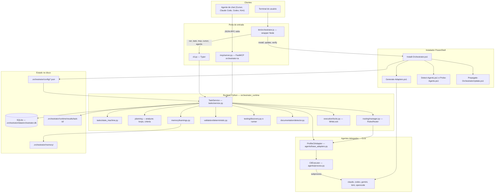

# Arquitetura

Componentes reais, com evidência de arquivo ou símbolo em cada afirmação.

## Mapa

## Camada 1 — Wrapper Node

`bin/orchestrator.js` é o único binário exposto pelo npm (`package.json:14-17`,
binários `orchestrator` e `mao`). Ele não implementa lógica de orquestração:
decide para onde encaminhar.

- `run`, `task`, `mcp`, `cursor`, `agents` vão para o runtime Python
  (`bin/orchestrator.js:155-170`, função `runRuntime` na linha 323).
- Todo o resto (`install`, `update`, `verify`, `repair`, `uninstall`, `status`,
  `analyze`, `global-tools`, `route`, `dispatch`, `legacy`) vai para o
  PowerShell (`runInstaller`, `bin/orchestrator.js:372`).

Duas decisões defensivas importam para operação:

- **Python**: prefere o venv do próprio pacote
  (`runtime/.venv/Scripts/python.exe`) antes de qualquer `python` do PATH
  (`findPython`, `bin/orchestrator.js:296-321`) — clientes MCP spawnavam o
  servidor com um Python sem dependências e ele morria no boot.
- **PowerShell**: tenta o nome nu e depois caminhos absolutos em
  `System32` e `Sysnative` (`findPowerShell`, `bin/orchestrator.js:272-294`),
  porque shells de agente chegam com PATH incompleto.

O wrapper injeta `PYTHONPATH=runtime/src`, `PYTHONUTF8=1` e
`PYTHONIOENCODING=utf-8` ao chamar o runtime (`bin/orchestrator.js:330-335`).

## Camada 2 — Instalador PowerShell

Ponto de entrada único: `scripts/Install-Orchestrator.ps1`, com um switch sobre
o parâmetro Command (`Install-Orchestrator.ps1:118` em diante). `init` é alias
de `install` e `upgrade` de `update` (`Install-Orchestrator.ps1:106-115`).

Etapas do `update`, na ordem em que o script as chama:

1. `Detect-Environment.ps1` — pré-voo.
2. `Sync-PackageSource` — `git pull` quando o PackageRoot é um clone.
3. `Update-Orchestrator.ps1` — sincroniza a estrutura de `.orchestrator/`.
4. Pipeline legacy: backup e migração antes de remover.
5. `Detect-Agents.ps1` — quais CLIs existem no PATH.
6. `Update-Agents.ps1` — atualiza os CLIs; opt-out `-SkipAgentUpdates`.
7. `Probe-Agents.ps1` — reconfere as flags aceitas por cada CLI; opt-out
   `-SkipAgentProbes`. Só a partir da 0.4.32 o branch de update passou a
   chamá-lo (comentário em `Install-Orchestrator.ps1:305-312`).
8. `Generate-Adapters.ps1` — copia e sincroniza adaptadores por vendor.
9. `Repair-AgentHooks.ps1` e `Repair-GraphifyHooks.ps1`.
10. `Install-Tools.ps1` e, opcionalmente, `Install-GlobalTools.ps1` mais
    `Configure-Mcps.ps1`.
11. `Validate-Orchestrator.ps1`, remoção e validação de legacy.

A biblioteca comum é `scripts/Orchestrator.Common.ps1` (1296 linhas), que
concentra caminhos, registro de projetos e helpers de JSON.

O registro da frota fica em
`%LOCALAPPDATA%\StarFusion\orchestrator\projects.json`, com override pela
variável de ambiente `ORCHESTRATOR_PROJECTS_REGISTRY`
(`Orchestrator.Common.ps1:1088-1094`). `Propagate-OrchestratorUpdate.ps1` lê
esse registro e roda o instalador em cada projeto
(`Propagate-OrchestratorUpdate.ps1:53-70`).

`Generate-Adapters.ps1` tem convenção própria: um arquivo `X.section.md` do
template é anexado a `X.md` na raiz do projeto e, se o marcador da primeira
linha já existir, o bloco é **sincronizado** em vez de duplicado
(`Generate-Adapters.ps1:58-101`). Sem isso, atualização de texto ficava presa no
template e nunca chegava aos projetos já instalados.

## Camada 3 — Runtime Python

Pacote `orchestrator_runtime`: 42 módulos, cerca de 11.8 mil linhas.

| Módulo | Responsabilidade | Símbolo-âncora |
|---|---|---|
| `config.py` | Carrega `.orchestrator/config/*.json` em objetos Pydantic; resolve o workspace | `load_config:200`, `resolve_default_workspace:114` |
| `tasks/service.py` | Orquestração de ponta a ponta, 3118 linhas | `TaskService:117`, `_execute_loop:767` |
| `tasks/state_machine.py` | Estados e transições permitidas | `ALLOWED_TRANSITIONS:37`, `assert_transition:136` |
| `tasks/repository.py` | Único ponto de acesso ao SQLite | `TaskRepository:39` |
| `planning/` | Classificação, critérios, loops, plano determinístico | `TaskAnalyzer:81`, `CriteriaBuilder:337`, `Planner:440`, `LOOPS` em `loops.py:68` |
| `routing/manager.py` | Papel para agente, agente para modelo | `RulesRouter.select_plan:47`, `resolve_model_candidates:146` |
| `manager_model/` | Decide aprovar, corrigir ou parar; regras por padrão, LLM opcional | `RulesManager.evaluate_iteration:76`, `build_manager:148` |
| `agents/` | Adapter genérico por profile JSON e executor de processo | `ProfileCliAdapter:60`, `CliExecutor:103` |
| `validation/` | Checagem determinística, parse do veredito LLM, portão final | `DeterministicValidator:20`, `LlmReviewValidator:208`, `CompletionGate:266` |
| `testing/` | Descoberta e execução da suíte do projeto | `TestDiscovery.discover:61` |
| `documentation/` | Gate documental | `DocumentationUpdater.ensure_usage_docs:35`, `DocumentationValidator.validate:108` |
| `memory/` | Schema SQLite e learnings | `memory/database.py`, `memory/learnings.py` |
| `execution/` | Lock de escrita, baseline git, worktrees, fan-out | `WriteLock:41`, `capture_baseline`, `create_worktree` |
| `mcp/` | Servidor MCP e as tools | `create_fastmcp_server:39` |
| `skills/` e `rules/` | Descoberta de skills e regras do projeto para injetar no prompt | `_skill_dirs:54`, `select_rules` |
| `callers.py` | Quem chamou muda eco, heartbeat e escolha de executor | `detect_caller:64`, `CallerProfile:40` |

Observação de arquitetura: vários módulos são **stubs de uma linha** que só
reexportam símbolos — `validation/completion_gate.py`, `validation/issues.py`,
`validation/llm_review.py`, `planning/planner.py`, `planning/criteria.py`,
`planning/strategies.py`, `memory/episodes.py`, `memory/performance.py`,
`memory/strategies.py`, `manager_model/rules.py`, `manager_model/local_llm.py`,
`manager_model/schemas.py`, `documentation/updater.py`,
`documentation/validator.py`, `testing/runner.py`. A implementação real está
concentrada em poucos arquivos grandes. Registrado em `limitacoes.md`.

## Camada 4 — Adapters de agente

Não há uma classe por CLI com lógica própria: `agents/claude.py`,
`agents/codex.py`, `agents/gemini.py`, `agents/kimi.py` e
`agents/opencode.py` têm 3 a 4 linhas cada. O comportamento vem de **JSON de
profile** em `.orchestrator/agents/profiles/*.json`, carregado por
`AgentRegistry._load` (`agents/__init__.py:81-105`) e interpretado por
`ProfileCliAdapter`.

`ProfileCliAdapter.build_command` (`agents/base_adapters.py:96`) monta a linha
nesta ordem: cli, subcomando, flags de sandbox, flag de modelo e modelo, flag de
prompt, prompt, argumentos extras.

Três proteções vivem aí:

- **Sandbox Windows**: `--sandbox workspace-write` vira `danger-full-access`
  quando `os.name == "nt"` (`agents/base_adapters.py:108-111`), porque
  `CreateProcessAsUserW` falha com erro 740 sem elevação.
- **Teto de argv**: acima de 30000 chars, ou 8000 para `.CMD` e `.BAT`, o
  prompt vai por stdin (`ARGV_LIMIT` em `agents/base_adapters.py:26`,
  `CMD_ARGV_LIMIT` na linha 33, decisão nas linhas 171-176). CLI que não aceita
  stdin (`prompt_stdin: false`, caso do `kimi`) falha com erro explicado e
  `exit_code=126` (`agents/base_adapters.py:181-201`).
- **Path absoluto**: o executável resolvido por `detect()` substitui o nome nu
  antes do spawn (`agents/base_adapters.py:147-149`), porque o PATH do processo
  MCP nem sempre resolve `.CMD`.

`CliExecutor.run` (`agents/process.py:137`) é quem spawna de fato: streams lidos
em threads, heartbeat, watchdog de silêncio, fail-fast de infra, redação de
linhas com cara de segredo (`redact`, `agents/process.py:68`) e kill em árvore
(`_kill_tree`, `agents/process.py:405`).

## Camada 5 — Servidor MCP

`mcp/server.py` cria um servidor FastMCP chamado `orchestrator-ia`
(`SERVER_NAME` em `mcp/server.py:21`, `create_fastmcp_server` na linha 39) e
registra doze tools: `orchestrator_health`, `orchestrator_analyze`,
`orchestrator_delegate`, `orchestrator_run`, `orchestrator_status`,
`orchestrator_events`, `orchestrator_result`, `orchestrator_cancel`,
`orchestrator_resume`, `orchestrator_message`, `orchestrator_agents` e
`orchestrator_memory_search` (`mcp/server.py:56-215`). Além delas, sete
resources com esquema `orchestrator://` (`mcp/server.py:217-243`) e prompts
vindos de `mcp/prompts.py`.

O servidor não duplica lógica: cada tool chama `OrchestratorMcpTools`, que por
sua vez usa `TaskService` (método `_service`, `mcp/tools.py:109`).

Duas regras de transporte:

- O servidor marca a origem no ambiente (variável `ORCHESTRATOR_CALLER_MCP`)
  antes de importar o resto (`mcp/server.py:11-14`), o que muda o perfil do
  chamador em `callers.py`.
- Bind remoto é bloqueado a menos que `ORCHESTRATOR_MCP_ALLOW_REMOTE=1`
  (`mcp/server.py:268-275`). No stdio, os logs do SDK caem para WARNING e stdout
  fica só com JSON-RPC (`mcp/server.py:279-286`).

## Camada 6 — Persistência

- **SQLite** em `.orchestrator/data/orchestrator.db` (`config.py:208-215` e
  `config.py:295`). O diretório recebe `chmod 0700` em Unix, best-effort em
  Windows (`config.py:210-214`). Engine e criação de schema em
  `create_session_factory` (`memory/database.py:216-219`): `Base.metadata.create_all`,
  sem ferramenta de migração.
- **Artefatos por task**:
  `.orchestrator/runtime/results/<task_id>/<papel>-<agente>.txt`
  (`tasks/service.py:2860-2909`), registrados na tabela `artifacts`.
- **Memória legível**: `.orchestrator/memory/episodes/<task>.md`
  (`_export_memory_markdown`, `tasks/service.py:3094`) e
  `.orchestrator/memory/learnings/` (`_learn_then_compact`,
  `tasks/service.py:3062`).
- **Patches do fan-out**:
  `.orchestrator/runtime/patches/<task_id>/<subtarefa>.patch`
  (`tasks/service.py:2650-2652`).
- **Lock de escrita**: arquivo
  `.orchestrator/runtime/locks/workspace.write.lock`
  (`tasks/service.py:160-162`), com PID e timestamp dentro e reivindicação
  automática quando o PID dono morreu (`execution/locks.py:49-71`).

O detalhe tabela a tabela está em `dados.md`.

## Fronteiras que valem lembrar

1. **Só o repositório fala com o banco.** Nenhum módulo fora de
   `tasks/repository.py` instancia as classes `*Row` de `memory/database.py`
   (verificado por varredura de cada classe do schema).
2. **Só o `CliExecutor` spawna processo de agente**, e ele sempre marca o filho
   com `ORCHESTRATOR_CHILD_AGENT=1` (`agents/process.py:157`).
3. **Só o `TaskService` transiciona estado**, sempre via
   `TaskRepository.transition` (`tasks/repository.py:235`), que revalida o
   estado no banco antes de gravar.
4. **O instalador nunca é chamado pelo runtime**: o wrapper Node escolhe um ou
   outro, nunca os dois na mesma invocação (`bin/orchestrator.js:431-443`).
