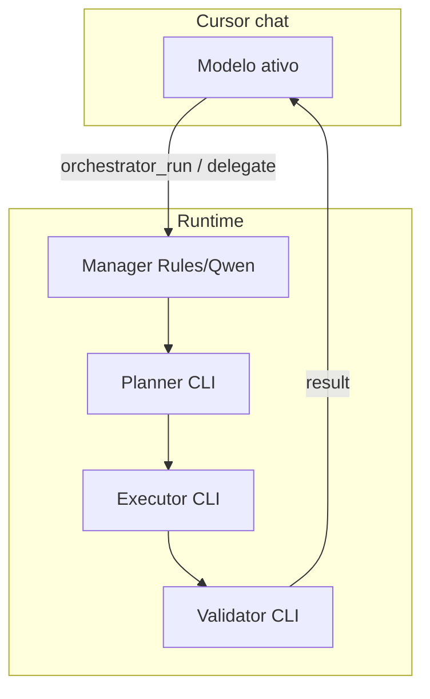

# Cursor front controller

Status: **implementado**

O modelo ativo no chat do Cursor (Grok, Claude, Gemini, …) é o **front controller**.

O Orquestrador (RulesManager / Qwen opcional) é o **manager interno** do workflow.

## Decisão

| Situação | Ação |
|---|---|
| Dúvida conceitual / typo sem lógica (exceções em multiagent-orchestrator.mdc) | Resposta direta |
| Bug fix / mudança de lógica (qualquer tamanho) | `orchestrator_run` (default, sem pedir) |
| Plano / review pontual | `orchestrator_delegate` |
| Multi-arquivo, testes, validação | `orchestrator_run` |

Não simular CLIs. Não declarar sucesso sem `orchestrator_result`.
