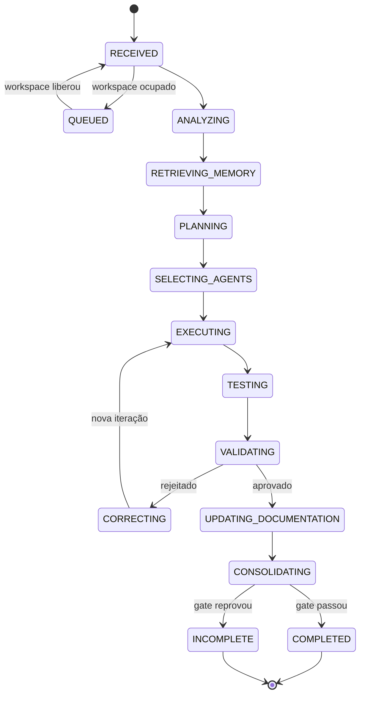

# Fluxo de execução

Ciclo de vida de uma task, estado a estado, com os pontos de decisão reais.
Salvo indicação contrária, os números de linha referem-se a
`runtime/src/orchestrator_runtime/tasks/service.py`.

## Estados

Dezessete estados em `TaskState` (`tasks/state_machine.py:10-27`):

```text
RECEIVED, QUEUED, ANALYZING, RETRIEVING_MEMORY, PLANNING, SELECTING_AGENTS,
EXECUTING, TESTING, VALIDATING, CORRECTING, UPDATING_DOCUMENTATION,
CONSOLIDATING, COMPLETED, INCOMPLETE, FAILED, WAITING_FOR_USER, CANCELLED
```

Terminais são só quatro (`tasks/state_machine.py:30-35`): `COMPLETED`,
`INCOMPLETE`, `FAILED`, `CANCELLED`. `WAITING_FOR_USER` **não** é terminal —
`can_resume` devolve `True` (`tasks/state_machine.py:146-147`).

As transições permitidas estão em `ALLOWED_TRANSITIONS`
(`tasks/state_machine.py:37-133`) e são checadas em `assert_transition`
(linha 136). Transição para o mesmo estado é no-op explícito (linha 137), para
não derrubar retry de MCP ou duplo resume.

## Caminho feliz



## 1. Criação — `create_task` (linha 231)

Ordem de acontecimentos:

1. **Reparo de mojibake** do prompt na ingestão (`repair_mojibake`, linha 245):
   terminal CP1252 entregava texto corrompido e ele era persistido assim.
2. **Varredura de zumbis**: `_cancel_stale_received` (linha 171) cancela tasks
   `RECEIVED` mais velhas que `stale_received_ttl_hours`.
3. **Deduplicação**: mesmo prompt e mesmo `dry_run` em janela de 120 s com task
   não-terminal devolve a existente e emite evento com `dedup: true`
   (`_DEDUP_WINDOW_S:207`, `_find_recent_duplicate:209`, uso na linha 250).
4. Cria o `TaskRecord` com as restrições (iterações, timeout, perfil, agentes
   forçados) e persiste.
5. **Onboarding de primeiro run** quando a base está vazia: sonda de agentes e
   índice de legacy-import (`_onboard_first_run:294`).

## 2. Fila por workspace — `run_task` (linha 657)

`run_task` decide antes de qualquer trabalho:

- Task já terminal, ou já em execução neste processo, retorna direto
  (linhas 659-666).
- `dry_run` desvia para `_dry_run` (linha 667), que só analisa e planeja.
- **Workspace ocupado**: `_busy_task_id` (linha 488) consulta
  `find_active_execution` (`tasks/repository.py:154`), que considera ocupada
  qualquer task em ANALYZING, RETRIEVING_MEMORY, PLANNING, SELECTING_AGENTS,
  EXECUTING, TESTING, VALIDATING, CORRECTING, UPDATING_DOCUMENTATION,
  CONSOLIDATING ou WAITING_FOR_USER. Se estiver ocupado, a task vai para
  `QUEUED` com `error = "queued_behind:<id>|pos=N"` (`_enqueue_task:508`).
- Livre: adquire o `WriteLock` e roda `_execute_loop` (linhas 693-702).
- `TimeoutError` do lock também vira `QUEUED`, nunca `FAILED` (linhas 705-712).
- No `finally`, se o lock chegou a ser tomado, `_maybe_start_next` (linha 556)
  desenfileira a próxima da FIFO.

Além da fila, há **adoção de órfã**: task `RECEIVED` cujo processo criador
morreu é assumida por quem observar, depois de
`orphan_received_adopt_after_s` (`_adopt_orphan_received:589`). `status` e
`list_tasks` chamam a adoção (linhas 366-369 e 456-460), então qualquer poll
tira a task do limbo.

## 3. ANALYZING (linha 779)

`manager.analyze_task` classifica o pedido. Com o manager padrão
(`RulesManager`, `manager_model/base.py:46`) isso é determinístico:

- `TaskAnalyzer.analyze` (`planning/analyzer.py:82`) define `task_type` por
  regex, na ordem: intenção de segurança, arquitetura, análise/auditoria, docs.
  **Verbo de implementação vence a palavra-chave** (linhas 115-119): um pedido
  para corrigir bug que menciona "análise" continua sendo `implementation`.
- Menção a segurança eleva o **risco** sem mudar a classificação
  (`planning/analyzer.py:127-132`).
- `detect_loop` escolhe o loop; o loop só refina o `task_type` quando não há
  intenção de implementação (`planning/analyzer.py:139-145`).
- `CriteriaBuilder.build` (`planning/analyzer.py:338`) monta os ACs com
  precedência: ACs declarados no prompt (`AC-001:` ou seção "Critérios:") vencem
  os critérios do loop, que vencem a heurística (linhas 339-348).

O resultado é salvo em `task.analysis`, preservando o contexto de
`requires_input`/resume (linhas 803-818) e registrando quem chamou
(`caller`, linha 817).

## 4. RETRIEVING_MEMORY (linha 822)

Duas buscas na tabela `memories`: episódios genéricos e, separadamente,
`kind="learning"` (linhas 823-825). Os learnings entram nos prompts de planner e
executor via `_learnings_block` (linha 1854).

Ainda nesta fase, antes de PLANNING, roda a **seleção de skills**
(`_select_skills`, linha 1711): um agente rápido escolhe até
`skill_selection_max_skills` entre as skills instaladas; se falhar, uma
heurística local decide (linhas 1750-1756). A descoberta varre
`.orchestrator/skills`, `.claude/skills`, `.codex/skills`, `.kimi-code/skills`,
`.gemini/skills`, `.agents/skills` do projeto e, opcionalmente, os equivalentes
no home (`skills/discovery.py:54-76`).

## 5. PLANNING (linha 839)

`manager.select_strategy` chama `RulesRouter.select_plan`
(`routing/manager.py:47`), que resolve os papéis:

- Ordem de preferência por papel: planner e validator preferem `claude`,
  executor e corrector preferem `codex` (`agents/__init__.py:130-135`).
- O CLI que já está atendendo o usuário é **evitado** como executor
  (`busy_agent` do perfil do chamador, `routing/manager.py:59-62`); é
  preferência, não restrição (`_pick`, linhas 123-127).
- **Validação independente**: se `require_independent_validation` e o validator
  saiu igual ao executor, o router troca; se não houver alternativa, levanta erro
  (`routing/manager.py:64-80`).
- Fallbacks de até dois agentes por papel são gravados no plano
  (`routing/manager.py:81-85`).

`Planner.plan` (`planning/analyzer.py:441`) monta o plano determinístico com os
cinco passos fixos (planner, executor, tester, validator, documentation) e, se
houver loop, o bloco `loop_stages`/`loop_done_when`. A decisão é gravada em
`routing_decisions` (linha 844).

## 6. SELECTING_AGENTS (linha 855)

O plano determinístico já existe; o refino pelo agente planner é **advisory**.
Dois tetos protegem a fase:

- `SELECTING_AGENTS_CAP_S = 180` (linha 122) — teto total da fase.
- `PLANNER_REFINE_CAP_S = 300` (linha 120) — teto do refino, aplicado como
  `min(refine_cap, restante da fase)` (linhas 891-895).

Falha do planner **não** aborta: vira evento `agent_completed` com
`status: failed` e o loop segue (linhas 903-914).

## 7. O laço principal (linha 924)

Cada volta começa recarregando a task e checando cancelamento
(`_ensure_runnable`, linha 441 — aborta com `CancelledError` se o banco disser
cancelada ou terminal).

Duas saídas antes de qualquer trabalho:

| Condição | Estado final | Evidência |
|---|---|---|
| Orçamento de tempo restante abaixo de `MIN_AGENT_TIMEOUT_S` | `INCOMPLETE` | linhas 927-942 |
| `iteration >= maximum_iterations` | `INCOMPLETE` | linhas 944-954 |

Depois incrementa a iteração (linha 956) e entra em `EXECUTING`. O papel é
`executor` na primeira volta e `corrector` a partir da segunda (linha 977).

### 7.1 Baseline de testes (linhas 983-1011)

Só na iteração 1: roda a suíte **antes** de o executor tocar a árvore e guarda o
resultado em `_run_ctx["test_baseline"]`. Serve para classificar falha como
`preexisting` em vez de cobrar do agente uma quebra que já existia. Falha de
infra no baseline não derruba a task (linhas 1008-1011).

### 7.2 Execução (linhas 1012-1087)

O prompt do executor é montado por `_build_executor_prompt` (linha 1917) e
inclui, nesta ordem: tarefa, bloco anti-subagente, briefing do loop, higiene
git, personas do projeto, cap de 3 commits, nota de continuação, critérios,
issues a corrigir, testes falhos separados entre introduzidos e pré-existentes,
memória, learnings, skills selecionadas, regras do projeto, ferramentas
obrigatórias e os contratos de saída (`PLAN_STATUS`, `PREMISE_MISMATCH`,
`REQUIRES_INPUT`).

Se `allow_parallel_workspace_writes` estiver ligado e a decomposição produzir
subtarefas com escopo disjunto, a **primeira** passada usa fan-out
(linhas 1027-1032); correção nunca usa. Detalhe na seção 10.

Exceção no spawn não aborta o workflow: vira issue `EXEC-FAIL` e a task segue
para `CORRECTING` (linhas 1037-1087).

### 7.3 Interpretação da saída do executor

Em ordem, logo após a execução:

| Sinal | O que acontece | Evidência |
|---|---|---|
| `PREMISE_MISMATCH: ...` | `COMPLETED` imediato com score 1.0, sem testes nem docs — premissa da task era falsa | linhas 1093-1132 |
| `REQUIRES_INPUT: {...}` sem arquivos alterados, primeira vez | `WAITING_FOR_USER` **sem** queimar iteração | linhas 1134-1168 |
| `REQUIRES_INPUT` de novo após resposta do usuário | Rejeição de infra e rotação de executor | linhas 1169-1189 |
| Spawn falhou (exit 127 / FileNotFoundError) | Issue `EXEC-SPAWN` | linhas 1191-1258 |
| exit 0, stdout vazio e nenhum arquivo | Issue `AGENT-EMPTY-OUTPUT` | mesmas linhas |
| exit != 0 e nenhum arquivo | Issue `AGENT-FAILED-NO-OUTPUT` | mesmas linhas |
| `PLAN_STATUS: {"complete": false}` | Manda **continuar**, devolvendo a iteração; teto `max_plan_continuations` | linhas 1271-1322 |
| Timeout sem arquivo alterado | Issue de timeout rotulada pela evidência (`_timeout_issue`, linha 2242) e rotação de executor | linhas 1324-1349 |

Os três casos de infra passam por `_reject_iteration_infra` (linha 2378), que
conta a issue, decide entre parar e corrigir, e **troca o executor** por um
fallback não em quarentena antes da próxima volta (linhas 2432-2447).

Quando o executor não reporta arquivos, o runtime pergunta ao git:
`_enrich_changed_files` (linha 2472) usa `changed_files_since` contra a baseline
capturada no início do loop (linha 773).

## 8. TESTING (linhas 1351-1391)

`TestRunner.run_all` roda o que `TestDiscovery.discover`
(`testing/discovery.py:61`) encontrou por marcador de stack: `package.json`
(`npm test`), projeto Python real (`pytest -q` ou `python -m pytest -q`),
`Cargo.toml`, `go.mod` (com `-short`, para pular teste de rede),
solução/projeto .NET com alvo explícito, `pom.xml`, `build.gradle`, `Makefile`
com alvo `test`.

Dois refinamentos que mudam o veredito:

- **Repos aninhados**: subdiretórios tocados que têm `.git` próprio também
  rodam (linhas 1355-1371).
- **Falha pré-existente**: teste cuja assinatura já falhava na baseline recebe
  `failure_kind = "preexisting"` e **não** derruba o gate (linhas 1383-1391).

Detecção de projeto Python evita varrer `**/test_*.py`, para não inventar
pytest em repositório Node (`testing/discovery.py:47-59`).

## 9. VALIDATING (linhas 1393-1581)

Três camadas, aplicadas em sequência:

1. **Determinística** — `DeterministicValidator.evaluate`
   (`validation/deterministic.py:21`) percorre os ACs e despacha por
   `CriterionKind` (linhas 124-132). Cada AC obrigatório não atendido custa
   0.2 e vira issue `VAL-00N`; cada teste falho não pré-existente custa 0.25.
   Critério `EVIDENCE`/`CUSTOM` sem parâmetro devolve `None` — indeterminado,
   nunca reprova (linhas 134-139).
2. **Independente por agente** — o validator recebe o prompt de
   `_build_validator_prompt` (linha 2193) e responde JSON;
   `LlmReviewValidator.parse` (`validation/deterministic.py:234`) aceita só
   `approved`/`rejected` como veredito (linha 213) e pega o último válido do
   texto. Se o validator falhar por infra (marcadores de erro 740 e afins,
   linhas 2302-2316), o runtime tenta um fallback e, não havendo, marca
   `validator_infra_failure` sem transformar isso em rejeição de mérito
   (linhas 1459-1480).
3. **Regra do mais rígido** — se o determinístico rejeitou, a rodada é
   rejeitada mesmo com o LLM aprovando (linhas 1481-1487). Teste falho força
   correção (`TEST-FAIL`, linhas 1488-1513) e timeout do agente injeta
   `AGENT-TIMEOUT` com score no máximo 0.2 (linhas 1515-1533).

A rodada grava hashes dos arquivos alterados e o `HEAD` do git
(`_collect_input_hashes`, linha 80) para permitir reauditoria, e persiste em
`validation_rounds` e `validation_issues` (linhas 1540-1555).

### Contagem de issue repetida

A identidade da issue é `id + descrição normalizada` (linha 1566), não só o id —
ids são posicionais e problemas diferentes caíam no mesmo `VAL-001` entre
iterações. Quando qualquer contagem atinge `same_issue_repeat_limit`, a decisão
vira `stop_incomplete` (linhas 1587-1592).

## 10. Fan-out opcional (0.4.61)

Ligado por `allow_parallel_workspace_writes`. `_decompose` (linha 2492) pede ao
planner uma decomposição em JSON; `execution/fanout.py` valida: escopos que se
sobrepõem são fundidos e decomposição degenerada devolve lista vazia
(`_conflicts`, `execution/fanout.py:65-80`) — escopo vazio conflita com tudo.

`_run_fanout` (linha 2595) cria um `git worktree` por subtarefa, roda os agentes
em paralelo com `asyncio.gather`, coleta um patch por worktree
(`collect_patch`) e aplica na árvore real (`apply_patch`). Patch que conflita é
**preservado** em `.orchestrator/runtime/patches/<task>/<sub>.patch` e vira
retrabalho, não trabalho perdido (linhas 2692-2697). Os worktrees são limpos no
`finally` (linhas 2732-2738). Cada subtarefa vira uma linha em `subtasks`
(`_record_subtask`, linha 2740).

## 11. Gate documental (linhas 1639-1659)

`DocumentationUpdater.ensure_usage_docs`
(`documentation/detector.py:35`) reúne os docs relacionados (`README.md`,
`CHANGELOG.md`, `docs/`, e `README.md` irmão de arquivo alterado) e valida os
links markdown locais (`DocumentationValidator.validate`, linha 108). Alvo não
verificável — âncora pura, rota que começa com `/`, placeholder com `<>` — é
ignorado em vez de reprovar (linhas 86-106). O resultado vai para
`task.documentation_review` e para a tabela `documentation_updates`.

## 12. CONSOLIDATING e o portão final (linhas 1661-1684)

`CompletionGate.can_complete` (`validation/deterministic.py:270`) exige, nesta
ordem:

1. testes passaram;
2. validação com `status == "approved"`;
3. score maior ou igual ao limiar (`minimum_validation_score`, padrão 0.9);
4. nenhuma blocking issue;
5. revisão documental presente;
6. `documentation_review["validation"] == "passed"`.

Falhou qualquer um: `INCOMPLETE` com o motivo. Passou tudo: `COMPLETED`,
evento `task_completed`, episódio persistido e markdown exportado.

## 13. O que termina cada caminho

| Fim | Causa | Evidência |
|---|---|---|
| `COMPLETED` | Portão de conclusão passou | linhas 1679-1684 |
| `COMPLETED` (premissa) | Executor emitiu `PREMISE_MISMATCH` | linhas 1093-1132 |
| `INCOMPLETE` | Iterações esgotadas, tempo esgotado, issue repetida, ou gate final reprovado | linhas 944-954, 927-942, 1587-1592, 1667-1677 |
| `FAILED` | Decisão `fail` do manager, ou exceção não tratada em `run_task` | linhas 1607-1613 e 713-733 |
| `CANCELLED` | `cancel` explícito, ou varredura de `RECEIVED` velho | linha 381 e linha 171 |
| `WAITING_FOR_USER` | Executor pediu decisão externa uma vez | linhas 1146-1168 |

## 14. Cancelamento

`cancel` (linha 381) marca `cancel_requested`, **mata os CLIs filhos vivos**
(`executor.kill_active`, linha 393) e transiciona para `CANCELLED`. Duas
proteções contra ressurreição:

- `TaskRepository.save` nunca sobrescreve estado terminal com objeto stale em
  memória (`tasks/repository.py:192-204`).
- `transition` relê o banco antes de gravar e, se um cancel concorrente venceu a
  corrida, levanta `CancelledError` em vez de emitir evento de uma transição que
  não aconteceu (`tasks/repository.py:246-280`).

Após cancelar, `_maybe_start_next` destrava quem estava atrás na fila
(linhas 432-438).

## 15. Sinais de vida

Enquanto um CLI roda, `CliExecutor` bate heartbeat na cadência do perfil do
chamador (20 s para sessão bloqueante, 30 s para MCP/Cursor —
`callers.py:52-61`), e o serviço **persiste** cada batida como evento
`agent_progress` (`_register_heartbeat`, linha 2754).

O watchdog de silêncio mata o agente que passa `agent_no_output_timeout_s` sem
escrever um byte **e** sem tocar no workspace (`agents/process.py:304-329`); a
sonda de progresso consulta o git (linha 2791). Sonda quebrada nunca mata o
agente (`agents/process.py:321-324`).
