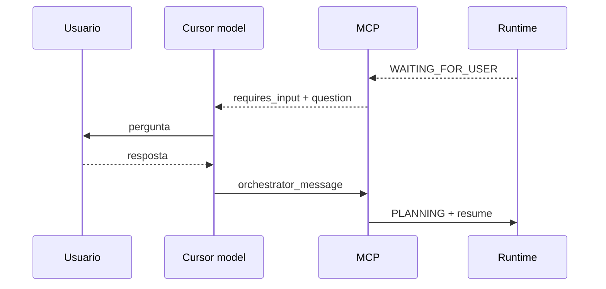

# Human approval flow

Status: **implementado** (contrato) · uso pleno depende do manager colocar a tarefa em `WAITING_FOR_USER`

`orchestrator_status` inclui `requires_input`, `question`, `options`, `risk` quando aplicável.
