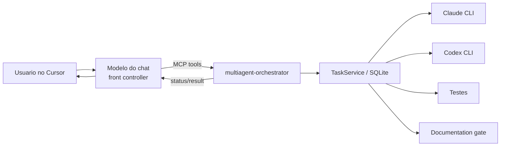

# MCP Integration

Status: **implementado** (stdio) · HTTP: **experimental**

## Diagrama



## Servir

```bash
orchestrator mcp serve --transport stdio
orchestrator mcp serve --transport http --host 127.0.0.1 --port 8765
orchestrator mcp status
orchestrator mcp doctor
```

HTTP bind remoto exige `ORCHESTRATOR_MCP_ALLOW_REMOTE=1`.

## Cursor

```bash
orchestrator cursor configure
orchestrator cursor verify
```

Em `orchestrator init` / `install` / `update`, o MCP é configurado **por padrão só no projeto** (`.cursor/mcp.json`, `CursorMcpScope=project`). Use `--cursor-mcp-scope user|both` para também gravar `~/.cursor/mcp.json`. Use `--skip-cursor` para pular.

A entry canônica (Python `cursor_config.py` + `Configure-CursorMcp.ps1`) usa `cmd /c orchestrator … --project ${workspaceFolder}`.

Comando dedicado:

```bash
orchestrator cursor configure
orchestrator cursor configure --cursor-mcp-scope user    # só global
orchestrator cursor configure --cursor-mcp-scope project # só projeto (default)
orchestrator agents --json                              # registry CLI
```

Ver também: [`cursor-front-controller.md`](cursor-front-controller.md), [`mcp-tool-reference.md`](mcp-tool-reference.md).
