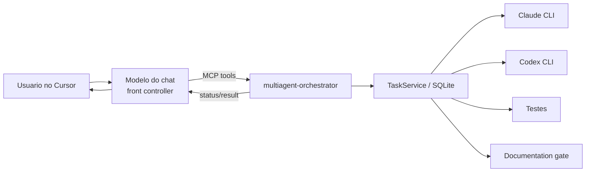

# MCP Integration

Status: **implementado** (stdio) · HTTP: **experimental**

## Diagrama



## Servir

```bash
orchestrator mcp serve --transport stdio
orchestrator mcp serve --transport http --host 127.0.0.1 --port 8765
orchestrator mcp status
orchestrator mcp doctor
```

HTTP bind remoto exige `ORCHESTRATOR_MCP_ALLOW_REMOTE=1`.

## Cursor

```bash
orchestrator cursor configure
orchestrator cursor verify
```

Gera/mescla MCP no projeto (`.cursor/mcp.json`) e no perfil global do Cursor (`~/.cursor/mcp.json`, escopo padrão `both`), além da rule `multiagent-orchestrator.mdc`.

```bash
orchestrator cursor configure
orchestrator cursor configure --cursor-mcp-scope user    # só global
orchestrator cursor configure --cursor-mcp-scope project # só projeto
```

Ver também: [`cursor-front-controller.md`](cursor-front-controller.md), [`mcp-tool-reference.md`](mcp-tool-reference.md).
