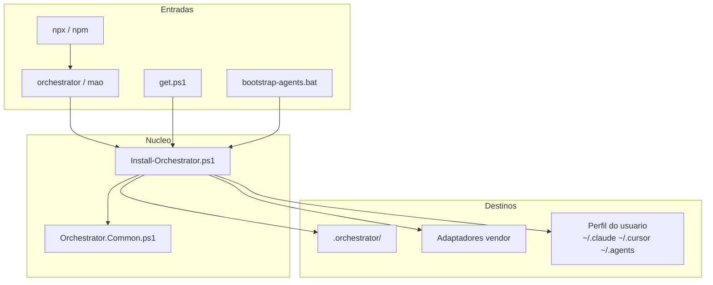

# Orquestrador Multiagente

Documento de referência do produto **`@starfusion/orchestrator`** (pacote `bootstrap-agents`, versão **0.3.0**).

Organização: **StarFusion** · Desenvolvedor: **Henrique Rodrigues**

Este arquivo descreve **o que o orquestrador faz**, **como faz**, e **todas as skills, MCPs, plugins e ferramentas** envolvidas.

**Legado vs atual:** até 0.1.x o ciclo era *soft* (skills). Em **0.2.0** chegou o runtime SQLite. Em **0.3.0** o chat do Cursor integra-se via MCP (`multiagent-orchestrator`) como front controller.

**Índice:** [1 O que é](#1-o-que-é) · [Runtime](runtime-architecture.md) · [MCP](mcp-integration.md) · [Cursor](cursor-front-controller.md) · [Docs policy](documentation-policy.md)

---

## 1. O que é

Instalador e mantenedor de um **ambiente multiagente genérico** em qualquer repositório. Não é um app de domínio: o projeto-alvo vira um workspace onde agentes (Claude, Codex, Cursor, Gemini, Kimi, OpenCode, …) compartilham a mesma configuração.

### Objetivos

1. Instalar de forma **determinística** (PowerShell + templates), sem depender de IA para montar pastas.
2. Manter a estrutura **por versão** (`update` incremental).
3. Configurar **ferramentas globais** (MCPs, plugins, skills, CLIs) no perfil do usuário, reutilizáveis em vários projetos.
4. Orientar **roteamento de modelos** (custo × capacidade) e **economia de tokens** (caveman).
5. Fornecer skills de orquestração (analisar → planejar → delegar → validar → aprender).

### Fluxo conceitual do ciclo multiagente

```text
entender → planejar → selecionar agentes → delegar → executar
    → testar → validar → corrigir → concluir → aprender
```

---

## 2. Arquitetura

### Fonte canônica

Tudo o que é política, skill, memória, agente, MCP e tool do **projeto** vive em:

```text
<projeto>/.orchestrator/
```

Adaptadores de vendor (`.claude/`, `CLAUDE.md`, `.cursor/rules/`, …) são **finos**: apontam para `.orchestrator/`. Não criar árvores paralelas de verdade.

### Camadas

| Camada | Onde | Papel |
|---|---|---|
| Pacote de distribuição | repo `bootstrap-agents` + `package/` | Template, manifest, scripts, bins npm |
| Template | `package/template/.orchestrator/` | Árvore copiada no `install` |
| Adaptadores | `package/template/adapters/<vendor>/` | Gerados na raiz do projeto-alvo |
| Catálogo global | `package/global-tools/catalog.json` | MCPs/plugins/skills/CLIs do **usuário** |
| Workspace | `<projeto>/.orchestrator/` | Instalação no projeto (muitas vezes gitignored) |

### Versões

| Arquivo | Significado |
|---|---|
| `VERSION` (raiz do pacote) | Versão do instalador/pacote |
| `.orchestrator/VERSION` | Versão instalada no workspace |

Se workspace **>** pacote → recusa (exit code **6**).



---

## 3. Como instalar e atualizar

### Entradas (mesma lógica)

| Entrada | Exemplo |
|---|---|
| **npx** | `npx --yes github:henrique-starfusion/bootstrap-agents#develop init` |
| **npm global** | `npm install -g github:henrique-starfusion/bootstrap-agents#develop` → `orchestrator` / `mao` |
| **PowerShell + gh** | `gh api …/get.ps1?ref=develop \| iex` |
| **Clone local** | `bootstrap-agents.bat init` / `.\install.ps1` |
| **Bin Node** | `bin/orchestrator.js` (Node ≥ 18) |

O bin Node localiza `powershell`/`pwsh`, mapeia flags `--*` → parâmetros PowerShell e chama `scripts/Install-Orchestrator.ps1`.

### Atualização (dois níveis)

```bash
# 1) Atualizar o CLI (pacote npm)
npm install -g github:henrique-starfusion/bootstrap-agents#develop

# 2) Atualizar a estrutura do projeto
cd C:\caminho\do\projeto
orchestrator update

# Ou tudo via npx (sem global)
npx --yes github:henrique-starfusion/bootstrap-agents#develop update
```

---

## 4. Comandos da CLI

| Comando | Função |
|---|---|
| `init` | Alias de `install` |
| `install` | Instala/completa `.orchestrator/` + tools + (por padrão) global-tools |
| `update` | Atualiza estrutura (manutenção principal); alias legado: `upgrade` |
| `verify` | Preflight + validação; não altera arquivos gerenciados |
| `repair` | Restaura arquivos managed ausentes/corrompidos |
| `uninstall` | Remove managed (backup prévio); `-Force` apaga `.orchestrator/` |
| `status` | Versões, agentes detectados, contagem de tools |
| `analyze` | Detect + validate (diagnóstico) |
| `skills` | Lista skills do registry do workspace |
| `global-tools` | Só instala/configura no **perfil do usuário** |
| `route` | Resolve `task_class` → modelo (`--client`, `--json`) |
| `dispatch` | Despacho único CLI (legado; Cursor deprecado) |
| `run` | **Runtime:** cria e executa tarefa completa |
| `task *` | **Runtime:** create/run/status/list/cancel/resume/logs/artifacts |

### Flags importantes

| Flag | Efeito |
|---|---|
| `--project` / `-ProjectPath` | Projeto-alvo (padrão: cwd) |
| `--force` | Sobrescreve managed / força reaplicação |
| `--dry-run` | Simula |
| `--skip-tools` | Não roda OpenWolf/Graphify |
| `--skip-tool-init` | Detecta tools, não faz `init` / `install --project` |
| `--skip-global-tools` | Não altera perfil do usuário |
| `--configure-mcps` | Força rewrite do MCP registry do workspace |
| `--update-agents` | Tenta atualizar CLIs de agentes (npm) |
| `--run-smoke-test` | Probes de agentes |

### Exit codes

| Código | Significado |
|---|---|
| 0 | OK |
| 1 | Erro / validação |
| 2 | Argumento inválido |
| 6 | Workspace mais novo que o pacote |

---

## 5. Pipeline de `install` / `init`

Ordem real em `scripts/Install-Orchestrator.ps1`:

1. Comparar SemVer (recusa se workspace > pacote)
2. `Detect-Environment.ps1` — preflight (espaço, PowerShell, git, …)
3. Lock → `.orchestrator/runtime/install.lock`
4. `Migrate-LegacyClaude.ps1` — se existe `.claude/VERSION` e ainda não há `.orchestrator/VERSION`
5. `Copy-TemplateTree` — copia `package/template/.orchestrator/`
6. `Apply-Manifest` — aplica `package/manifest.json`
7. Sincroniza `.orchestrator/VERSION` se ausente
8. `Detect-Agents.ps1` — quem está no PATH
9. `Generate-Adapters.ps1` — CLAUDE.md, rules Cursor, etc.
10. `Install-Tools.ps1` — OpenWolf + Graphify no **projeto** (init por padrão)
11. `Install-GlobalTools.ps1` — CLIs/MCPs/plugins/skills no **usuário**
12. `Configure-Mcps.ps1` — espelho no registry do workspace
13. `Validate-Orchestrator.ps1` + `Validate-Hooks.ps1`
14. Opt-ins: `Update-Agents`, `Probe-Agents`
15. `Write-InstallationReport.ps1` → `runtime/reports/installation-report.md`
16. Remove lock

### Pipeline de `update`

1. Preflight
2. `Sync-PackageSource` — `git pull` se o PackageRoot for clone
3. `Update-Orchestrator.ps1` — backup se bump/`-Force`; migrations `*.ps1`; template + manifest; VERSION
4. Redetect agents + adapters
5. Install-Tools (init por padrão)
6. Install-GlobalTools + Configure-Mcps
7. Validate + relatório

Biblioteca compartilhada: `scripts/Orchestrator.Common.ps1`.

---

## 6. Layout de `.orchestrator/` (template)

```text
.orchestrator/
├── VERSION
├── README.md
├── config/           # orchestrator, models, policies, routing, validation, tools
├── agents/           # registry, capabilities, detected, profiles, adapters
├── skills/           # skills ativas + external/ + quarantined/
├── memory/           # index + architecture, decisions, lessons, project, …
├── orchestration/    # roles, schemas, templates, workflows
├── mcp/              # registry, configs, audits, disabled
├── tools/            # registry, openwolf/, graphify/, optional/
├── scripts/          # agents, hooks, maintenance, memory, validation
├── hooks/            # active, disabled, tested
├── runtime/          # locks, logs, plans, reports, results, tasks, …
└── schemas/          # schemas de artefatos
```

### Modes do manifest (`package/manifest.json`)

| Mode | Comportamento |
|---|---|
| `managed` | Copia se ausente; com `-Force` sobrescreve |
| `merge` | Copia **só se destino ausente** (preserva customização; não é deep-merge) |
| `generated` | Ex.: `detected.json`, `tools/registry.json` — regenerável |
| `user-owned` | Nunca sobrescreve |
| `runtime` | Artefatos de execução |

---

## 7. Skills do orquestrador (workspace)

Registradas em `.orchestrator/skills/registry.json` e instaladas a partir do template:

| Skill | O que faz |
|---|---|
| `economize-tokens` | Liga caveman + roteamento cost-aware em todo ciclo |
| `orchestrate` | Coordena o pipeline multiagente |
| `analyze-project` | Inspeciona estrutura e convenções do repo |
| `analyze-task` | Decompõe o pedido e define `task_class` |
| `plan-task` | Plano executável com checkpoints |
| `select-agents` | Escolhe cliente/modelo por capability e custo |
| `call-agent` | Invoca agente (CLI ou Task Cursor com `model=`) |
| `run-tests` | Executa testes e captura resultado |
| `validate-result` | Score vs critérios de aceite |
| `correction-loop` | Retry/replan dentro dos limites de política |
| `save-knowledge` | Persiste achados em `memory/` |

Pastas auxiliares: `skills/external/` (skills externas), `skills/quarantined/` (quarentena).

---

## 8. Ferramentas de projeto (OpenWolf / Graphify)

Script: `scripts/Install-Tools.ps1`.

| Tool | Detecção | Init (padrão no install/update) | Artefatos |
|---|---|---|---|
| **OpenWolf** | `openwolf` no PATH (npm `-g`) | `openwolf init` → `.wolf/` | `tools/openwolf/status.json` |
| **Graphify** | `graphify` (ou instala via `uv tool install graphifyy`) | `graphify install` (usuário) + `graphify install --project` | `tools/graphify/status.json` |

Registry agregado: `.orchestrator/tools/registry.json`.

Falhas **não abortam** o bootstrap.

---

## 9. Ferramentas globais (perfil do usuário)

Script: `scripts/Install-GlobalTools.ps1`  
Catálogo: `package/global-tools/catalog.json`  
Relatório: `.orchestrator/tools/global-status.json`

### CLIs

| Origem | Pacote | Comando |
|---|---|---|
| npm `-g` | `openwolf` | `openwolf` |
| npm `-g` | `firecrawl-cli` | `firecrawl` |
| uv tool | `graphifyy` | `graphify` (+ post `graphify install`) |

### MCPs (Claude user + Cursor `~/.cursor/mcp.json`)

| ID | Pacote / comando |
|---|---|
| `context7` | `npx -y @upstash/context7-mcp` |
| `playwright` | `npx -y @playwright/mcp@latest` |
| `sequential-thinking` | `npx -y @modelcontextprotocol/server-sequential-thinking@latest` |

Playwright também é indicado para Codex (via plugin oficial; o instalador **não** reescreve `~/.codex/config.toml`).

### Plugins Claude (`claude plugin install … -s user`)

- `context7@claude-plugins-official`
- `playwright@claude-plugins-official`
- `superpowers@claude-plugins-official`
- `skill-creator@claude-plugins-official`
- `atlassian@claude-plugins-official`
- `frontend-design@claude-plugins-official`
- `caveman@caveman`

### Skills globais (`npx skills add <source> -g` → `~/.agents/skills`)

| ID | Source GitHub | Notas |
|---|---|---|
| `superpowers` | `obra/superpowers` | Workflow / using-superpowers |
| `find-skills` | `vercel-labs/skills` | Descoberta de skills |
| `firecrawl` | `firecrawl/cli` | Hub Firecrawl |
| `terraform-skill` | `antonbabenko/terraform-skill` | Terraform/OpenTofu |
| `caveman` | `juliusbrussee/caveman` | ~75% menos prosa |

---

## 10. MCP no workspace vs global

| Escopo | Onde | Quem grava |
|---|---|---|
| Global (ativo no cliente) | `~/.claude`, `~/.cursor/mcp.json` | `Install-GlobalTools` |
| Workspace (espelho/docs) | `.orchestrator/mcp/registry.json` | `Configure-Mcps` (no `install`/`update` se global-tools não forem skipados; `-ConfigureMcps` força rewrite) |

O registry do workspace lista Context7, Playwright e Sequential Thinking (stdio via `npx`, `scope: global`) — espelho para políticas/auditoria do projeto. A instalação efetiva nos clientes IDE é a global.

Subpastas: `mcp/configs/`, `mcp/audits/`, `mcp/disabled/`.

Template inicial: `servers: []` até o primeiro `Configure-Mcps`.

---

## 11. Roteamento de modelos e economia de tokens

Config: `.orchestrator/config/models.json`  
Rotas: `.orchestrator/config/routing.json`  
Políticas: `.orchestrator/config/policies.json`  
Docs: [`model-routing.md`](model-routing.md)

### Tiers

| Tier | Uso típico | Claude (alias) | Cursor (slug) |
|---|---|---|---|
| `fast` | trivial, classify | `haiku` | `claude-4.5-haiku` |
| `balanced` | docs, impl, review, tests | `sonnet` | `claude-sonnet-5-thinking-high` |
| `deep` | architecture, hard debug | `opus` | `claude-opus-4-8-thinking-high` |
| `max` | complex analysis, long agentic | `fable` | `claude-fable-5-thinking-high` |

Codex: `gpt-5.6-terra-medium` → `gpt-5.6-sol-medium` → `gpt-5.6-sol`.

### Comandos

```bash
orchestrator route --task-class complex_analysis --client cursor
orchestrator route --task-class docs --client claude --json
orchestrator dispatch --task-class docs --client claude --prompt "Atualize o README"
```

Scripts: `Resolve-ModelRoute.ps1`, `Invoke-RoutedAgent.ps1`.

### Classes de tarefa (`task_classes`)

| Classe | Tier |
|---|---|
| `trivial`, `classify` | fast |
| `docs`, `documentation`, `implementation`, `refactor_simple`, `code_review`, `tests` | balanced |
| `architecture`, `debugging_hard`, `security_review` | deep |
| `complex_analysis`, `long_agentic`, `orchestration_plan` | max |

### Armadilha Cursor

`Task` **sem** `model=` herda o modelo do chat pai (ex.: Grok em todos os subagentes).  
Regra: `.cursor/rules/token-economy.mdc` — **obrigatório** passar `model=` com o slug de `route`.

### Caveman

Plugin/skill global; intensidade padrão `full`. Código, paths e erros **não** abreviar. Desligar só com pedido explícito do usuário.

---

## 12. Detecção de agentes, adaptadores e profiles

### Agentes verificados no PATH (`Detect-Agents.ps1`)

`claude`, `codex`, `gemini`, `kimi`, `kimi-code`, `opencode`, `qwen`, `qwen-code`, `copilot`, `github-copilot`, `aider`, `goose`, `amp`, `kiro`, `cursor`, `continue`, `openhands`, `openclaw`, `droid`, `factory`

Saída: `.orchestrator/agents/detected.json`

### Adaptadores gerados (template → raiz do projeto)

| Vendor | Artefatos típicos |
|---|---|
| Claude | `CLAUDE.md`, `.claude/README.md`, skills de adapter |
| Codex | `AGENTS.md`, `.codex/README.md` |
| Cursor | `CURSOR.md`, `.cursor/rules/*.mdc` (orchestrator, token-economy, git-workflow, …) |
| Gemini | `GEMINI.md`, `.gemini/README.md` |
| Kimi | `KIMI.md`, `.kimi/README.md` |
| OpenCode | `AGENTS.md` / `.opencode/README.md` |

### Profiles de invocação (`agents/profiles/*.json`)

Declaram **como** chamar cada CLI (mecânica). Modelo por tarefa fica em `config/models.json`. Novo CLI = novo JSON nesta pasta.

| Profile | kind | verified | Invocação típica |
|---|---|---|---|
| `claude` | `cli` | sim | `claude --model <alias> -p "…"` |
| `codex` | `cli` | sim | `codex exec -m <model> "…"` |
| `opencode` | `cli` | sim | `opencode run --model <model> "…"` |
| `gemini` | `cli` | não* | `gemini -m <model> -p "…"` |
| `kimi` | `cli` | não* | `kimi …` (flags best-effort) |
| `cursor` | `ide-hint` | — | sem CLI; hint para `Task model="<slug>"` |

\* `verified: false` = flags extraídas de docs, não testadas neste host.

Campos úteis do profile: `invoke.subcommand`, `invoke.prompt_flag` (`null` = prompt posicional), `invoke.sandbox_flags` (só se o usuário pedir), `timeout_default_s`, `output.json_flags`.

### Skill `call-agent` + `dispatch`

Fluxo obrigatório ao delegar:

1. Classificar `task_class`
2. `orchestrator route --task-class … --client … --json`
3. Ler `agents/profiles/<client>.json`
4. Preferir `orchestrator dispatch` em **foreground** (stream ao vivo, heartbeat 30s, timeout do profile)
5. Conferir `runtime/results/<stamp>-<task_class>-status.json` → `"status": "completed"`

Artefatos em `runtime/results/`:

| Arquivo | Conteúdo |
|---|---|
| `*-model-choice.json` | Rota escolhida |
| `*-result.txt` | Saída do agente |
| `*-status.json` | `completed` \| `failed` \| `timeout` + exit_code / duration |

**Anti-recursão:** se `ORCHESTRATOR_CHILD_AGENT` estiver setado, o filho **não** pode `dispatch` de novo. Ao spawnar, setar `ORCHESTRATOR_CHILD_AGENT=1`.

Divisão de responsabilidade:

| Arquivo | Papel |
|---|---|
| `agents/profiles/<cli>.json` | COMO invocar |
| `config/models.json` | QUAL modelo por `task_class` |
| `config/policies.json` | Limites de iteração / validação |

---

## 13. Políticas e validação

### `config/policies.json` (principais)

- Máximo de iterações: **3**
- Limite de repetir o mesmo issue: **2**
- Score mínimo: **0.9**
- Melhoria mínima: **0.03**
- Validação independente + determinística
- Parallel read-only: permitido; parallel writes: **não**
- Token economy ligada; `forbid_max_tier_for`: trivial/classify/docs

### `config/validation.json`

Scaffold de validação (threshold 0.9); validators concretos ainda evoluem via skills.

### `orchestration/roles.json`

Papéis: orchestrator, planner, executor, tester, validator.

### Memória

`memory/` guarda decisões, lições, projeto, falhas, etc. Skill `save-knowledge` escreve ali.

---

## 14. Scripts PowerShell (mapa)

| Script | Papel |
|---|---|
| `Install-Orchestrator.ps1` | Entrada de todos os comandos |
| `Orchestrator.Common.ps1` | Paths, SemVer, manifest, invoke externo, resolve PATH |
| `Update-Orchestrator.ps1` | Update estrutural + migrations |
| `Repair-Orchestrator.ps1` | Repara managed |
| `Uninstall-Orchestrator.ps1` | Desinstalação |
| `Detect-Environment.ps1` | Preflight |
| `Detect-Agents.ps1` | Agentes no PATH |
| `Generate-Adapters.ps1` | Adaptadores vendor |
| `Install-Tools.ps1` | OpenWolf / Graphify no projeto |
| `Install-GlobalTools.ps1` | Catálogo global |
| `Configure-Mcps.ps1` | Registry MCP do workspace |
| `Validate-Orchestrator.ps1` | Validação estrutural |
| `Validate-Hooks.ps1` | Hooks tested/active |
| `Update-Agents.ps1` | Atualiza CLIs de agentes |
| `Probe-Agents.ps1` | Smoke probes |
| `Migrate-LegacyClaude.ps1` | `.claude` → `.orchestrator` |
| `Write-InstallationReport.ps1` | Relatório markdown |
| `Resolve-ModelRoute.ps1` | `route` |
| `Invoke-RoutedAgent.ps1` | `dispatch` |

Testes: `tests/Run-AllTests.ps1` (fixtures temporárias; usam `-SkipGlobalTools`).

---

## 15. O que é automático vs política (soft)

### Hard (código)

- Runtime + SQLite + state machine + gates (testes, validação, documentação)
- Cursor não é worker
- Global-tools / OpenWolf / Graphify opt-in
- Install, update, verify, repair, uninstall, locks, SemVer
- `route` / `dispatch` com resolução de modelo
- Validação estrutural e relatório do instalador

### Soft (agente deve obedecer)

- Skills como orientação quando o runtime não estiver disponível
- Sempre passar `model=` no Task do Cursor **se** usar fallback legado
- Não usar Fable/Opus para docs/trivial (policies + rules)

### Reservado / ainda leve em v0.2

- Workers Docker (interface preparada; não exigidos no MVP)
- LocalLlmManager completo (hook existe; fallback Rules)
- `orchestrator tools install <id>` granular (use `global-tools` / `--init-tools`)
- Deep-merge JSON no mode `merge`
- Smoke opt-in com CLIs reais (CI usa `--fake-agents`)

---

## 16. Documentação relacionada

| Doc | Conteúdo |
|---|---|
| [`runtime-architecture.md`](runtime-architecture.md) | Runtime persistente |
| [`task-lifecycle.md`](task-lifecycle.md) | Estados da tarefa |
| [`agent-adapters.md`](agent-adapters.md) | Adapters CLI |
| [`cursor-integration.md`](cursor-integration.md) | Cursor como cliente |
| [`documentation-policy.md`](documentation-policy.md) | Gate documental |
| [`../README.md`](../README.md) | Visão geral e instalação |
| [`cli-reference.md`](cli-reference.md) | Referência de comandos/flags |
| [`installer-architecture.md`](installer-architecture.md) | Arquitetura do instalador |
| [`global-tools.md`](global-tools.md) | Tools/MCPs/plugins globais |
| [`model-routing.md`](model-routing.md) | Modelos e caveman |
| [`quickstart-oneliner.md`](quickstart-oneliner.md) | One-liner |
| [`repo-layout.md`](repo-layout.md) | Layout deste repositório |
| [`troubleshooting.md`](troubleshooting.md) | Problemas comuns |
| [`legacy-migration.md`](legacy-migration.md) | Migração `.claude` → `.orchestrator` |
| [`legacy/`](legacy/) | Material deprecado |

---

## 17. Resumo em uma frase

O orquestrador **instala e mantém** `.orchestrator/` + adaptadores, **executa** o ciclo multiagente no runtime Python (SQLite + gates), **configura** (opt-in) MCPs/plugins/skills/CLIs no perfil do usuário, e **define** (via config + `route`/`dispatch`/runtime) qual modelo/agente usar — com evidências persistentes — em qualquer repositório.
